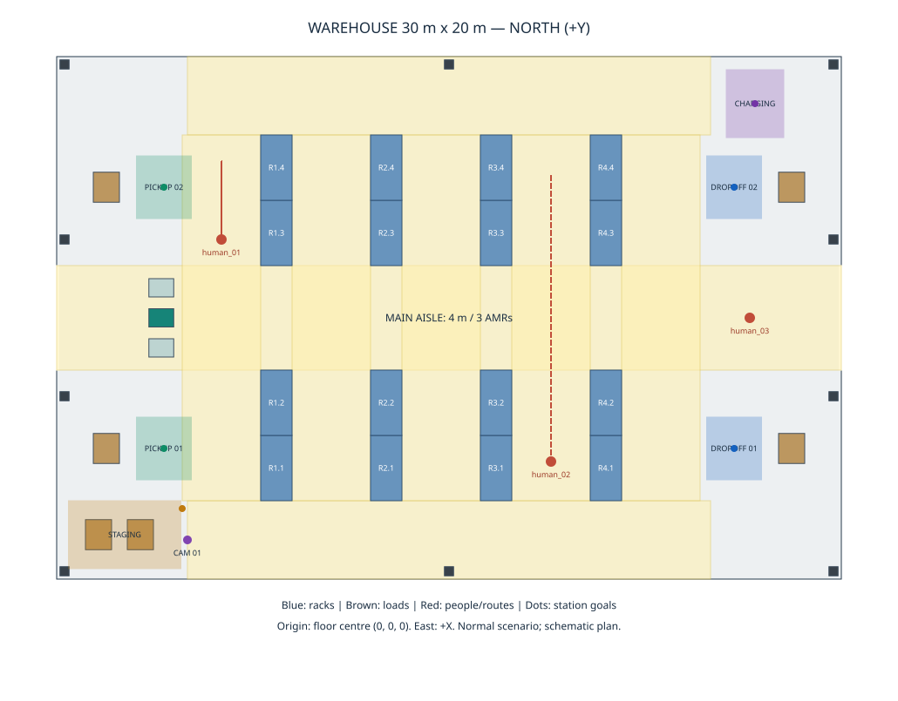
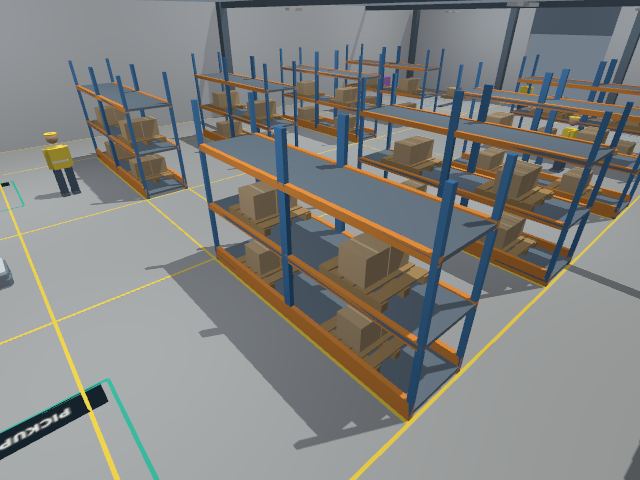
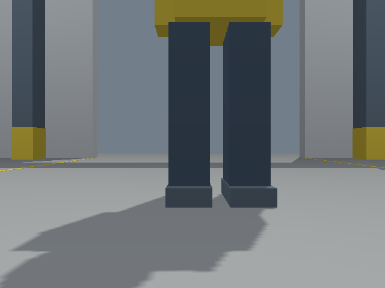
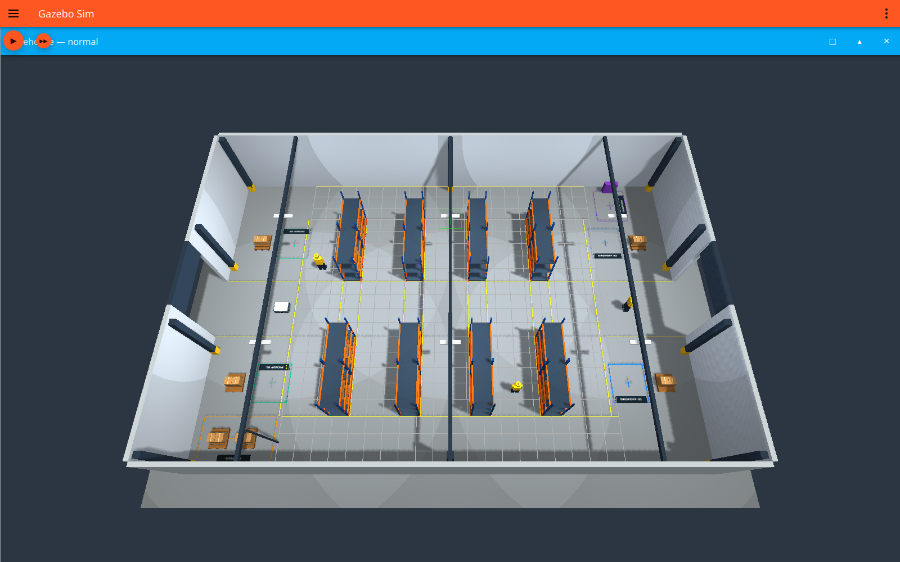
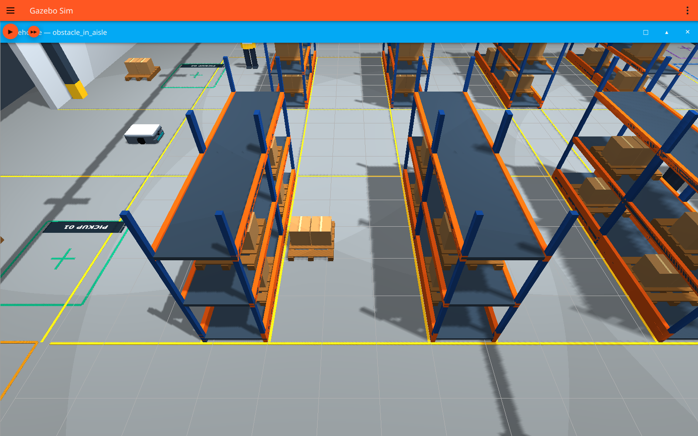
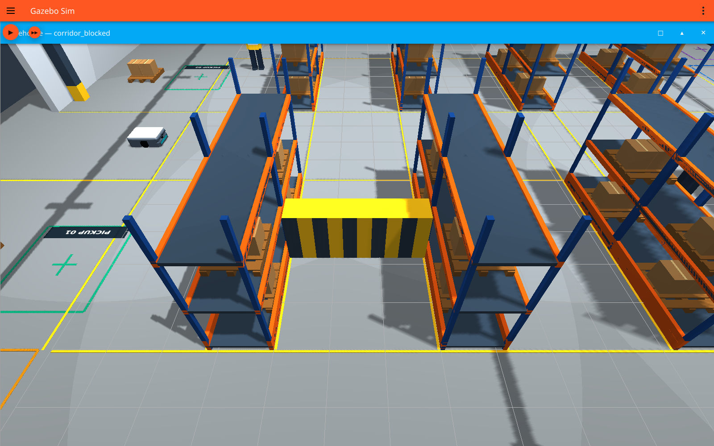

# Galpão industrial — relatório de implementação e aceitação

Gerado em 2026-10-03T17:10:27-03:00. Evidências
do mesmo manifesto SHA-256 `aaa9dc056558941cc9b37510b4396c8355ffb47cf1a322d84daf51e25d69af14`. Resultados abaixo são medições reais;
os logs e JSON em cada diretório de cenário permitem verificá-los.

## Ambiente e auditoria

Ubuntu 24.04; ROS 2 Jazzy;
Gazebo Harmonic / Sim 8.15.0; SDFormat 14.9.0. GUI `ogre`;
servidor e sensores Ogre2/EGL, com `--headless-rendering`.
Hardware observado: Intel i5-10300H, 8 threads; Intel UHD e GTX 1650.
Nesta máquina, Ogre2 usa Mesa/Zink/NVK na GTX 1650; a captura GUI isolada usa
Ogre/llvmpipe em Xvfb. Não foi feita automação de mouse ou teclado.

[AUDIT.md](AUDIT.md) registra os pacotes, dependências, sensores, launch,
Git e testes anteriores. `amr_simulation` foi continuado na retomada;
o único arquivo funcional alterado em `amr_description` é `sim.launch.py`,
com argumentos opcionais de world, spawn, resources e GUI. Seus defaults
foram preservados. Não houve cópia de URDF, modificação de amr_dimensions.json,
commit, reset ou introdução de outra arquitetura. Os três artefatos de
validação AMR já modificados antes deste trabalho foram preservados.

## Arquitetura e geração

`warehouse_layout.json` + `scenarios/*.json` + dimensões existentes do AMR
→ `generate_warehouse.py` → modelos SDF reutilizáveis, quatro composições SDF,
bridge, GUI, planta SVG, poses de estações e manifesto de hashes.
`validate_warehouse.py` verifica configuração, nomes, referências, SDF,
reconstrução determinística e idempotência. O launch rejeita fontes ou
artefatos alterados sem regeneração. Não há downloads durante a execução.

Modelos: `wh_building`, `wh_rack`, `wh_pallet`, `wh_box`, `wh_loaded_pallet`,
`wh_barrier`; placas em `wh_signs/meshes`. Pessoas, câmera e estações são
geradas por funções parametrizadas. Primitivas em todas as colisões;
somente placas visuais usam pequenas malhas COLLADA/texturas locais.
Não foi necessário Blender. A geometria e as imagens são originais;
Pillow/DejaVu Sans do sistema geram as placas, sem redistribuir a fonte.

## Layout e critérios dimensionais

Interior livre entre paredes: **30 × 20 m (600 m²)**; altura **5 m**;
paredes **0,25 m**, envelope exterior **30,5 × 20,5 m**;
piso com apron **34 × 24 m**, espessura **0,20 m**.
Origem no centro do piso acabado; +X leste, +Y norte, +Z para cima.
Duas aberturas operacionais de **4 × 3,6 m**, a oeste e leste;
10 pilares, 3 vigas superiores, luz direcional e 6 luminárias.
Cobertura aberta para inspeção superior, sem telhado opaco.

AMR **0.95 × 0.70 m**;
diagonal mais 0,30 m de folga de cada lado =
**1.780 m**.
Três AMRs lado a lado exigem 3×0,70 + 2×0,30 + 2×0,30 = **3,30 m**.
O eixo transversal principal tem **4 m**; sete corredores secundários ou
perimetrais têm **3 m**, comportando giro e duas faixas nominais.
Estas são margens geométricas de simulação, sem certificação de segurança.

**16 racks** de 1,2 × 2,5 × 3,2 m: quatro fileiras em
x = -6,6; -2,4; 1,8; 6,0, cada uma com quatro módulos em
y = -5,75; -3,25; 3,25; 5,75. O corredor principal separa os setores norte/sul.
Há **38 pallets e 76 caixas** no cenário normal: 32 cargas nos racks
(duas prateleiras carregadas por módulo), quatro nas zonas pickup/dropoff
e duas em staging. `obstacle_in_aisle` acrescenta um pallet e duas caixas.
Recebimento a oeste, expedição a leste e charging no canto nordeste.

## Estações e múltiplos AMRs

Poses prontas para uso posterior, registradas em `config/station_poses.json`.
O frame é **world**, sem transformação artificial para map/odom. Ao implantar
SLAM, registrar o mapa em relação a essas coordenadas antes de usá-las como goals.

| Estação | x, y (m) | yaw (rad) |
|---|---|---|
| `pickup_station_01` | -10.9, -5 | 3.1416 |
| `pickup_station_02` | -10.9, 5 | 3.1416 |
| `dropoff_station_01` | 10.9, -5 | 0.0000 |
| `dropoff_station_02` | 10.9, 5 | 0.0000 |
| `charging_station` | 11.7, 8.2 | 1.5708 |
| `staging_area` | -10.2, -7.3 | 3.1416 |

Cada estação tem marcação própria. Staging tem goal livre diferente do centro
ocupado pelas cargas; essa aproximação foi afastada do poste da câmera.
Spawns (x; y): amr_01=(-11; 0), ativo; amr_02=(-11; 1,15) e amr_03=(-11; -1,15),
inativos. Apenas um AMR é iniciado. Zonas restritas e bloqueios temporários
estão registrados como metadados; não há Nav2, SLAM, AMCL ou gestão de frota.

## Pessoas, detecção e obstáculos

Três manequins físicos: human_01 percorre o corredor de serviço oeste
(no cenário person_crossing cruza y=0); human_02 percorre longitudinalmente
o corredor x=3,9; human_03 permanece próximo à expedição.
Os dois móveis usam `TrajectoryFollower` nativo, por forças e torques,
com rotas e condições iniciais configuradas. Não usam teletransporte.

Cada pessoa tem visual humano simplificado, pernas visíveis no plano do LiDAR
e cilindro sólido de colisão (raio 0,28 m, altura 1,75 m). A representação
física conservadora preenche também o vão entre as pernas.
Actors foram descartados porque [não recebem forças de contato no Harmonic](https://gazebosim.org/docs/harmonic/actors/).
O [TrajectoryFollower](https://gazebosim.org/api/sim/8/classgz_1_1sim_1_1systems_1_1TrajectoryFollower.html)
move modelos físicos; contatos podem alterar sua trajetória e seu tempo.
Uma segunda inicialização independente de person_crossing foi comparada no
mesmo tempo simulado: diferença máxima de posição **0.0071 m**
entre as duas execuções (tolerância de 0,05 m, interpolação linear).
Evidência: [repeatability.json](repeatability.json).

Person scan: **1.148 m**. O AMR parou com separação no eixo X entre
centros de **0.753 m** da human_03, e o sistema Contact
registrou **11759 pares de contato**. Não atravessou a pessoa.
Paredes e racks também bloquearam deslocamento medido por ground truth.
O pallet no corredor foi detectado, impediu avanço na faixa ocupada e permitiu
passagem pela faixa restante. A barreira sólida de 3 m fechou todo o aisle_01
e impediu avanço, com contato positivo. Ativação/desativação por cenário no launch.

No Gazebo Sim 8, o sistema Contact exige `sensor/contact/topic` para o tópico
customizado; a configuração foi corrigida após consultar a
[implementação oficial](https://github.com/gazebosim/gz-sim/blob/gz-sim8/src/systems/contact/Contact.cc).
A primeira falha de leitura da parede era o pilar corretamente detectado;
as duas geometrias agora têm medições separadas.

## Sensores, câmera fixa e movimento

GPU LiDAR existente: 361 amostras, 180°, 15 Hz, `laser_frame`, alcance
0,08–20 m, plano z≈0,213 m. Resultados: parede **1.260 m**,
pilar **0.778 m**, rack **1.060 m**,
caixas do pallet **1.120 m**.
RGB-D continua 640×480; profundidade da carga **1.083 m**,
PointCloud2 X-forward **1.083 m**, em `camera_depth_frame`.
IMU próxima de 9,81 m/s² em repouso, joint_states e TF aprovados.

Câmera fixa `warehouse_camera_01`: posição (x=-10; y=-8,5; z=4,4 m), pitch 0,53,
yaw 0,85 rad; 640×480, 10 Hz, FOV horizontal 1,4 rad.
Tópicos `/warehouse/camera_01/image_raw` e `/warehouse/camera_01/camera_info`;
TF estático world → warehouse_camera_01_link → warehouse_camera_01_optical_frame.
Imagem com racks, circulação e pessoa capturada; não substitui a RGB-D móvel.

Linha reta: **1.341 m**, odometria **1.341 m**;
giro: **1.087 rad**; curva, travessia de corredor entre racks
e timeout de 0,5 s aprovados. `/cmd_vel` permanece **TwistStamped**.
Nos testes de colisão não se confunde odometria de rodas com movimento real.

| Tópico | Amostras recebidas no cenário normal |
|---|---:|
| `/imu/data` | 8875 |
| `/warehouse/camera_01/camera_info` | 897 |
| `/camera/camera_info` | 1358 |
| `/scan` | 1357 |
| `/joint_states` | 8873 |
| `/camera/depth/image_raw` | 1305 |
| `/camera/points` | 1137 |
| `/camera/image_raw` | 1307 |
| `/warehouse/camera_01/image_raw` | 783 |
| `/odom` | 4429 |

## Testes e performance

| Cenário headless | Resultado | Verificações | Tempo simulado (s) | RTF médio | RTF min–max |
|---|---|---:|---:|---:|---:|
| normal | aprovado | 81 | 89.7 | 0.569 | 0.000–1.073 |
| person_crossing | aprovado | 37 | 25.5 | 0.567 | 0.000–1.052 |
| obstacle_in_aisle | aprovado | 48 | 40.1 | 0.544 | 0.000–1.086 |
| corridor_blocked | aprovado | 43 | 25.7 | 0.566 | 0.000–1.310 |

RTF coletado de `/world/warehouse/stats` durante os testes com todos os
sensores e observadores ativos; inclui startup/assentamento. Depende da carga
da máquina e do driver. Não é benchmark de frota. Não se alteraram taxas dos sensores AMR.

`colcon build` executado no workspace completo. Testes pytest do galpão,
10 arquivos SDF com `gz sdf --check`, determinismo, idempotência, hashes,
poses e rejeição de configurações inválidas aprovados. Regressão original do
AMR (URDF, display/RViz, headless, sensores, movimento, GUI Ogre) aprovada
em cópia temporária para preservar evidências preexistentes.

A suíte completa do workspace foi executada antes e depois. **Há uma falha
preexistente em test_flake8 de my_py_pkg: 12 ocorrências de estilo**;
pep257 aprovado e copyright skipped. Isso não é apresentado como suíte toda
verde, nem foi alterado para mascarar o resultado. Ver arquivos baseline e
`workspace_test_results.txt`. Não há falha nova atribuída ao warehouse.

## Warnings e limitações conhecidas

- `gz_frame_id` dos sensores AMR é extensão Gazebo, avisada pelo parser SDF;
  preservada, com frames e tópicos efetivamente validados.
- Inicialização ros2_control avisa sobre espera do robot_description, IMU
  fora de hardware_info e estatísticas de hardware; a IMU vem pelo ros_gz.
  Controle a 100 Hz e física a 1000 Hz também geram aviso informativo.
- O timeout de comando é esperado no teste de parada. Ogre2 avisa sobre bits
  reservados de visibility mask; imagens, scan e depth foram verificados.
- Logs internos Ogre podem conter avisos de material/shader do backend;
  não foram usados como substituto para inspeção das capturas reais.
- Pallet vazio de 0,15 m fica abaixo do feixe 2D a 0,213 m. As caixas sobre
  ele são detectadas; RGB-D vê obstáculos baixos. Isso é limite geométrico
  do sensor existente. Colisão do pallet permanece ativa.
- Pessoas são manequins deslizantes, sem marcha articulada ou comportamento
  social. Movimento físico por waypoints tem condições iniciais repetíveis,
  mas contatos alteram o cronograma; não é promessa de replay bit a bit
  entre drivers/máquinas. O follower pode ultrapassar levemente o waypoint
  ao frear/inverter. Não implementa desvio inteligente de pessoas.
- As folgas para três AMRs são planejamento geométrico; somente um foi
  instanciado e testado. Missões, mapa, localização e navegação ficam para
  as próximas etapas. Câmera tem intrínsecos/extrínsecos de simulação,
  sem pipeline de visão ou calibração de câmera real.

## Operação e arquivos

Comandos exatos em [README.md](../README.md): regeneração/build/aceitação,
GUI, cenários, headless e controle TwistStamped.
Arquivos novos agrupados: config, config/scenarios, scripts, launch, models,
worlds, tests, CMakeLists.txt, package.xml, README e validation deste pacote.
Única integração no pacote existente: `amr_description/launch/sim.launch.py`.
Inventário completo: [FILES.txt](FILES.txt); estado Git: [git_status.txt](git_status.txt)
e [git_diff_stat.txt](git_diff_stat.txt). Não foi realizado commit.
